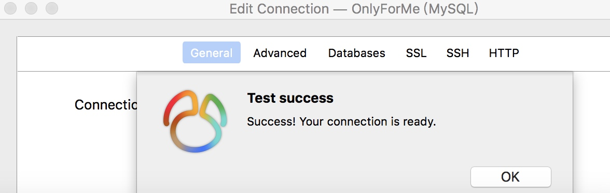

#数据库的使用
## 远程连接
### 前言
今天突然想把自己在阿里云上的服务器装个数据库，就换了个镜像，是windws sever，然后就开始了我的数据库连接之路。
1. 首先通过cmd进入到mysql的安装目录下的**bin**文件夹下
2. 然后输入 ```mysql -rroot -p``` 登陆mysql，之后会让你输入密码
3. 登陆后我们首先创建一个用户 ```create user '用户名'@'登陆范围' identified by '密码'```,其中**用户名**就是你登录要输入的，**登陆范围**是只允许本机登陆的话填**localhost**，任意地方的话填**%**，密码可以填也可以不填
4. 创建完用户后需要给这个用户赋予权限，我直接把所有权限都赋了，``` grand ALL on *.* to '用户名'@'登陆范围'``` 就OK了
5. 


